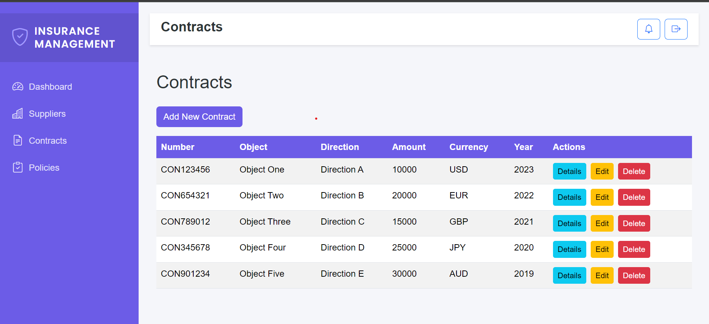

  # Supplier, Contract, and Insurance Management App

This is a full-stack web application built with **React** on the frontend and **Spring Boot** on the backend. The app facilitates the management of suppliers, contracts, and insurance policies, providing CRUD operations for each entity. 

## Application Dashboard

## Supplier Data

## Add Supplier

## Contract Data

## Contract Details

## Policy Data

## Login

## Features

### 1. Supplier Management
The application allows users to manage supplier information including:
- **ICE** (Supplier Identifier)
- **IF** (Tax Identifier)
- **Supplier Name**
- **Address**
- **City**

#### Functionalities:
- Create, Read, Update, and Delete (CRUD) suppliers.
- Easily view and manage all supplier data in an organized table.

### 2. Contract Management
The app provides an interface to handle contracts with the following attributes:
- **Market Number**
- **Object** (Description of the contract)
- **Direction** (Contract's business unit)
- **Amount** (Total contract value)
- **Device** (Currency of the contract)
- **Year** (Year of the contract)

#### Functionalities:
- CRUD operations for contracts.
- View contract details in a structured way, with the ability to manage related data.

### 3. Insurance Policies Management
Users can manage insurance policies with the following data points:
- **Insurance Number**
- **Insurance Label**
- **Requires** (Whether certain requirements are met: Yes/No)
- **Status** (Active/Expired/Upcoming)
- **Start Date**
- **End Date**

#### Functionalities:
- CRUD operations for insurance policies.
- Ability to associate funds with the corresponding insurance steps and policies.

## Technology Stack

- **Frontend**: React.js (JavaScript, HTML, CSS)
- **Backend**: Spring Boot (Java)
- **Database**: MySQL
- **Build Tool**: Maven for the backend, Webpack for the frontend.

## Getting Started

### Prerequisites
- Java 22+
- Node.js and npm
- MySQL Database

